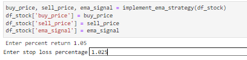
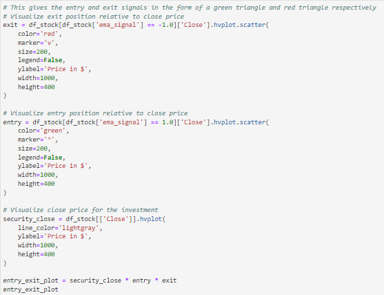
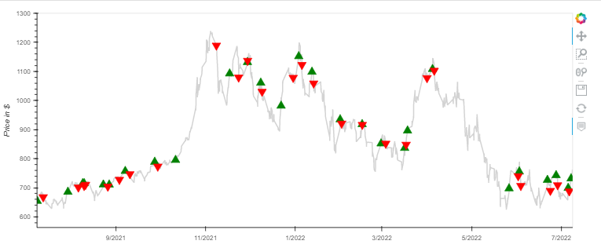
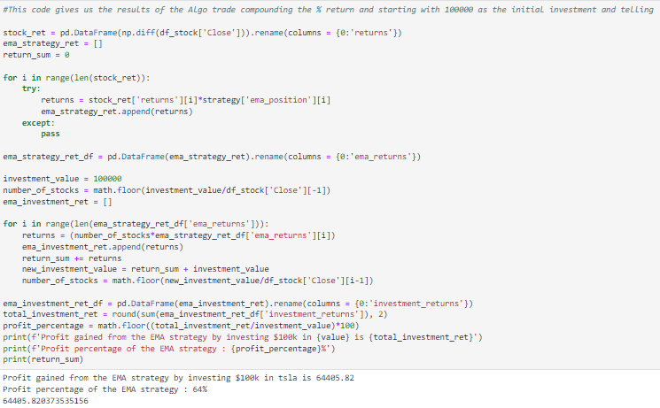

# Algo Trading Project
Algo strategy execution with backtest displayed on line price chart with estimated returns. Allows user to adjust candlestick trade timeframe and TP/StopLoss for varying results. New feautures added as needed. Run on jupyterlab.

Currenet strategy revolves around EMA's and ADX. Long positions only. Short position algo will be added with next update.

--- 

## Technologies

This project leverages Python 3.7 and Jupyter Lab with the following packages:

* [Pandas] (https://github.com/pandas-dev/pandas) - To create and manipulate dataframes
* [Numpy] (https://github.com/numpy/numpy) - To calculate and add indicators to dataframes
* [YFinance] (https://github.com/ranaroussi/yfinance) - To pull market data for analysis
* [Tradingview-TA] (https://github.com/brian-the-dev/python-tradingview-ta) - For market sentiment & recommendations from Tradingview
* [MPLFinance] (https://github.com/matplotlib/mplfinance) - Used to create candlestick chart & display indicators 
* [HVPlot] (https://github.com/holoviz/hvplot) - Used to backtest algo strategy and display on hvplot as buy and sell signals

(Import code blocks included in application)

--- 

## Installation Guide

Before running the application, first install the following dependencies 

```python
  pip install pandas
  pip install numpy
  pip install yfinance
  pip install tradingview_ta
  pip install --upgrade mplfinance
  pip install hvplot
  
```

---

## Examples

Upon running the inital code for yfinance data, you will asked to input a stock ticker for data.


Input in the following format 


-

The following code will display a candlestick chart with 8/13/21 EMA's, ADX, and Volume. Must run all code blocks beforehand for this to display properly.


--- 

After running the implement_ema_strategy function, running the following code will prompt you with a Take Profit % and Stop Loss %. Set these according to your preferences to backtest your algo against historical data. Also adds the buy_price, sell_price, and ema_signal (whether trade meets criteria) to dataframe.



---

The following code prints the hvplot line chart that displays entry and exit points against historical data. 





--- 

After running all previous code, the following code gives us the results of the Algo trade by compounding % return and starting with 100000 as the initial investment.



---

## Usage

To use the Algo Trading Project application, clone the repository and run the **Backtest Trade Algorithm.ipynb** on Jupyter Lab. 

Currently does not connect to brokerages, however the entry signals can be used to take trades manually.

---

## Contributors

Anand Krishnan (https://github.com/merutzu) - Recommended libraries to use for project and helped troubleshoot implementation.


